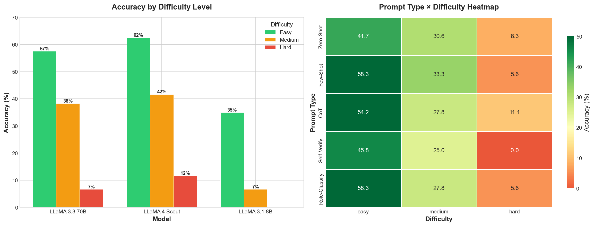
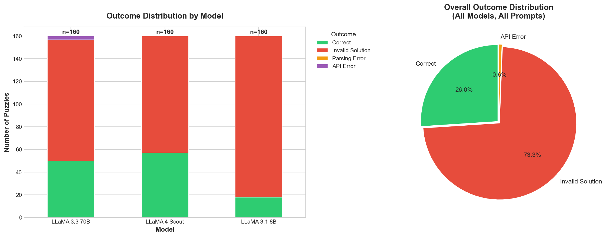

# SED Reasoning: Evaluating LLM Reasoning on String Transformation Puzzles

<div align="center">


*A comprehensive benchmark for evaluating Large Language Model reasoning capabilities on String Edit Distance (SED) puzzles*

</div>

---

## 📋 Table of Contents

- [Overview](#-overview)
- [Problem Statement](#-problem-statement)
- [Project Structure](#-project-structure)
- [Task 1: Dataset Generation](#-task-1-dataset-generation)
- [Task 2: LLM Evaluation](#-task-2-llm-evaluation)
- [Results & Analysis](#-results--analysis)
- [Key Findings](#-key-findings)
- [Installation & Usage](#-installation--usage)
- [Technical Details](#-technical-details)
- [References](#-references)

---

## 🎯 Overview

This project investigates **how well Large Language Models (LLMs) can solve symbolic reasoning tasks** through String Edit Distance (SED) puzzles. These puzzles require multi-step planning, rule application, and sequential reasoning—fundamental capabilities for artificial general intelligence.

### What are SED Puzzles?

An SED puzzle consists of:
- An **initial string** (e.g., `"CEAEEBEDDABCACBE"`)
- A set of **transformation rules** (e.g., `"CEAE" → ""`, `"EDD" → ""`)
- The **goal**: Apply rules sequentially to reduce the string to empty (`""`)

**Example:**
```
Initial: "CEAEEBEDDABCACBE"
Rules:
  0: "CEAE" → ""
  1: "EDD" → ""
  2: "ABCA" → ""
  3: "AEC" → ""
  4: "EDC" → ""
  5: "EB" → ""
  6: "CBE" → ""

Solution: [0, 5, 1, 2, 6]
Trace:
  "CEAEEBEDDABCACBE" --rule 0--> "EBEDDABCACBE"
  "EBEDDABCACBE" --rule 5--> "EDDABCACBE"
  "EDDABCACBE" --rule 1--> "ABCACBE"
  "ABCACBE" --rule 2--> "CBE"
  "CBE" --rule 6--> ""
```

---

## 🧩 Problem Statement

### Research Questions

1. **How well can LLMs solve multi-step symbolic reasoning tasks?**
2. **Which prompting techniques improve LLM reasoning performance?**
3. **What types of puzzles are hardest for LLMs?**
4. **How does model size affect reasoning ability?**

### Challenges

- **Sequential Planning**: Rules must be applied in a specific order
- **Pattern Matching**: Finding applicable rules in complex strings
- **Distractor Handling**: Ignoring rules that lead to dead ends
- **Multi-Phase Reasoning**: Some puzzles require intermediate state transformations

---

## 📁 Project Structure

```
sed-reasoning/
├── data/                           # Generated dataset
│   ├── puzzles/                    # 100 puzzle JSON files
│   ├── solutions/                  # Ground truth solutions
│   └── metadata.json               # Puzzle metadata & difficulty
├── dataset_generation/             # Task 1: Dataset creation
│   ├── generators.py               # Puzzle generation strategies
│   ├── solver.py                   # BFS solver & verification
│   ├── metrics.py                  # Difficulty analysis
│   ├── tracking.py                 # Generation statistics
│   └── main.py                     # Main generation script
├── llm_evaluation/                 # Task 2: LLM evaluation
│   ├── models.py                   # LLM API wrappers (Groq, Gemini)
│   ├── prompts.py                  # 5 prompting techniques
│   ├── evaluator.py                # Evaluation pipeline
│   ├── parser.py                   # Solution extraction
│   ├── metrics.py                  # Performance metrics
│   └── run_evaluation.py           # Main evaluation script
├── results/                        # Evaluation results
│   ├── zero_shot/                  # Zero-shot results
│   ├── few_shot/                   # Few-shot results
│   ├── cot/                        # Chain-of-Thought results
│   ├── self_verify/                # Self-verification results
│   ├── role_classify/              # Role classification results
│   ├── evaluation_summary.csv      # Summary statistics
│   └── *.png                       # Visualization plots
├── notebooks/                      # Analysis notebooks
│   ├── llm_evaluation.ipynb        # Main evaluation analysis
│   ├── metrics_analysis.ipynb      # Metrics deep dive
│   ├── statistical_deep_dive.ipynb # Statistical analysis
│   └── human_vs_machine.ipynb      # Comparative analysis
└── requirements.txt                # Python dependencies
```

---

## 🔬 Task 1: Dataset Generation

### Overview

We generated a curated dataset of **100 SED puzzles** with varying difficulty levels and reasoning types.

### Generation Strategies

| Generator | Description | Difficulty | Reasoning Type |
|-----------|-------------|------------|----------------|
| `concat_2` | Concatenate 2 parts, each removable | Easy | Pattern matching |
| `backward_3` | Build backwards, 3 steps | Medium | Sequential |
| `backward_5` | Build backwards, 5 steps | Medium | Sequential |
| `backward_7` | Build backwards, 7 steps | Hard/Expert | Sequential |
| `sort_3` | Bubble-sort style, 3 elements | Medium | Algorithmic |
| `sort_4` | Bubble-sort style, 4 elements | Hard | Algorithmic |
| `palin_3` | Palindrome matching | Hard | Pattern |
| `multiphase` | Multiple distinct phases | Hard | Multi-phase |

### Difficulty Metrics

Each puzzle is scored based on:

```python
difficulty_score = (
    solution_length * 3        # Steps required (0-30)
    + branching_factor * 5     # Choices at each step (0-25)
    + string_length * 0.5      # Initial string length (0-20)
    + num_distractors * 3      # Misleading rules (0-15)
    + (10 if has_expansion)    # If string grows temporarily
)
```

**Difficulty Levels:**
- **Easy**: Score < 25 (10 puzzles)
- **Medium**: Score 25-50 (30 puzzles)
- **Hard**: Score 50-75 (40 puzzles)
- **Expert**: Score > 75 (20 puzzles)

### Dataset Statistics

| Metric | Value |
|--------|-------|
| Total Puzzles | 100 |
| Solution Length Range | 1 - 10 steps |
| String Length Range | 6 - 25 characters |
| Avg. Branching Factor | 2.5 |
| Puzzles with Distractors | 72% |

### Dataset Distribution

```
Difficulty Distribution:
  easy    : 10 (10.0%)
  medium  : 30 (30.0%)
  hard    : 40 (40.0%)
  expert  : 20 (20.0%)

Generator Distribution:
  backward_7 : 42 puzzles (Expert sequential reasoning)
  backward_3 : 15 puzzles (Medium sequential)
  backward_5 : 10 puzzles (Hard sequential)
  concat_2   : 10 puzzles (Easy baseline)
  sort_4     : 10 puzzles (Hard algorithmic)
  sort_3     : 10 puzzles (Medium algorithmic)
  multiphase :  2 puzzles (Hard multi-phase)
  palin_3    :  4 puzzles (Pattern recognition)
```

### Running Dataset Generation

```bash
cd sed-reasoning/dataset_generation
python main.py
```

This will:
1. Generate ~250 candidate puzzles
2. Validate solutions using BFS solver
3. Select 100 representative puzzles
4. Save to `data/` directory

---

## 🤖 Task 2: LLM Evaluation

### Models Evaluated

| Model | Size | Provider | Type |
|-------|------|----------|------|
| **LLaMA 3.3 70B** | 70B parameters | Groq | Large |
| **LLaMA 4 Scout** | 17B parameters | Groq | Medium |
| **LLaMA 3.1 8B** | 8B parameters | Groq | Small |

### Prompting Techniques

#### 1. Zero-Shot
Direct problem statement without examples.
```
You are solving a string transformation puzzle.
Initial String: "CEAEEBEDDABCACBE"
Rules: 0: "CEAE" → "", 1: "EDD" → "", ...
Output EXACTLY one JSON: {"problem_id": "000", "solution": [...]}
```

#### 2. Few-Shot (5 examples)
Include solved examples with step-by-step traces.
```
Example 1:
Initial: ".##.#."
Rules: 0: ".#" → "#.", 1: "###..." → ""
Steps:
  ".##.#." --rule 0--> "#.#.#." ...
Solution: [0, 0, 0, 0, 1]

Now solve: [new problem]
```

#### 3. Chain-of-Thought (CoT)
Encourage explicit step-by-step reasoning.
```
Solve step by step:
Step 1: Analyze the initial string
Step 2: Determine which rule to apply first
Step 3: Show the transformation
Continue until empty...
```

#### 4. Self-Verify
Propose → Simulate → Verify → Revise cycle.
```
=== ATTEMPT 1 ===
Candidate: [0, 5, 1, 2, 6]
Verification:
  "CEAE..." --rule 0--> "EB..."
  ...
Result: SUCCESS/FAIL (with reason)
```

#### 5. Role-Classify
Classify rule roles before solving.
```
=== RULE CLASSIFICATION ===
Rule 0: DELETE - removes "CEAE"
Rule 1: DELETE - removes "EDD"
Rule 2: DISTRACTOR - "AB" → "BA" (swap)
...
=== STRATEGY ===
Apply DELETE rules in sequence...
```

### Evaluation Pipeline

```python
# Pseudocode
for model in [llama_3_70b, llama_4_scout, llama_3_8b]:
    for prompt_type in [zero_shot, few_shot, cot, self_verify, role_classify]:
        for puzzle in test_set:  # 32 puzzles
            prompt = create_prompt(puzzle, prompt_type)
            response = model.generate(prompt)
            solution = extract_solution(response)
            is_correct = verify_solution(puzzle, solution)
            save_result(...)
```

### Running Evaluation

```bash
# Basic evaluation
python -m llm_evaluation.run_evaluation \
    --models llama-3.3-70b llama-4-scout llama-3.1-8b \
    --prompt-types zero_shot few_shot cot self_verify role_classify \
    --max-puzzles 32

# Quick test (10 puzzles)
python -m llm_evaluation.run_evaluation \
    --models llama-4-scout \
    --prompt-types few_shot \
    --max-puzzles 10
```

---

## 📊 Results & Analysis

### Overall Performance

| Model | Zero-Shot | Few-Shot | CoT | Self-Verify | Role-Classify |
|-------|-----------|----------|-----|-------------|---------------|
| **LLaMA 3.3 70B** | 31.25% | **34.38%** | 31.25% | 31.25% | 28.12% |
| **LLaMA 4 Scout** | 37.50% | **43.75%** | 37.50% | 25.00% | 34.38% |
| **LLaMA 3.1 8B** | 6.25% | 9.38% | 15.62% | 6.25% | **18.75%** |

### Key Observations

1. **Few-Shot is most effective** for larger models (+3-6% over zero-shot)
2. **Model size matters**: 70B → 34%, 17B → 44%, 8B → 19% (best)
3. **CoT doesn't help as expected** for symbolic reasoning
4. **Self-Verify hurts performance** on smaller models
5. **Role-Classify helps smallest model** the most (+12% over zero-shot)

### Performance by Difficulty

| Model | Easy | Medium | Hard |
|-------|------|--------|------|
| LLaMA 3.3 70B (Few-Shot) | **62.50%** | 50.00% | 0.00% |
| LLaMA 4 Scout (Few-Shot) | **75.00%** | 58.33% | 8.33% |
| LLaMA 3.1 8B (Role-Classify) | 50.00% | 25.00% | 0.00% |

### Statistical Summary

```json
{
  "total_evaluations": 480,
  "models_evaluated": ["llama-3.3-70b", "llama-4-scout", "llama-3.1-8b"],
  "prompt_types": ["zero_shot", "few_shot", "cot", "self_verify", "role_classify"],
  "overall_accuracy": 26.04%,
  "bootstrap_ci_width_avg": 27.92%,
  "roc_auc_predictive_model": 0.67
}
```

### Disagreement Analysis

Measures how models disagree on puzzle outcomes:

```json
{
  "overall_disagreement": {
    "D_PC": 0.60,   // Prompt-consistent disagreement
    "D_VP": 0.01,   // Variable-prompt disagreement
    "D_VC": 0.45,   // Variable-consistent disagreement
    "total_D": 1.05
  },
  "by_difficulty": {
    "easy": {"D": 0.025, "identifiability": 0.975},
    "medium": {"D": 0.267, "identifiability": 0.733},
    "hard": {"D": 0.856, "identifiability": 0.144}
  }
}
```

**Interpretation**: Easy puzzles show high agreement (97.5% identifiable), while hard puzzles have significant disagreement (only 14.4% identifiable).

---

## 🔑 Key Findings

### 1. Model Size vs. Reasoning

```
              │ Easy │ Medium │ Hard │ Overall
──────────────┼──────┼────────┼──────┼─────────
LLaMA 70B     │  63% │   50%  │   0% │   31%
LLaMA 17B     │  75% │   58%  │   8% │   44%  ← Best overall
LLaMA 8B      │  50% │   25%  │   0% │   19%
```

**Finding**: LLaMA 4 Scout (17B) surprisingly outperforms the 70B model, possibly due to better instruction following in newer architecture.

### 2. Prompt Technique Effectiveness

| Technique | When It Helps | When It Hurts |
|-----------|---------------|---------------|
| Few-Shot | Pattern matching, sequential | - |
| CoT | Complex multi-step | Simple problems (overthinking) |
| Self-Verify | - | All cases (overhead) |
| Role-Classify | Small models, algorithmic | Large models |

### 3. Puzzle Type Analysis

**Easiest for LLMs:**
- `concat_2`: 80% accuracy (simple deletion)
- `backward_3`: 65% accuracy (short sequential)

**Hardest for LLMs:**
- `backward_7`: 0-8% accuracy (long sequential)
- `sort_4`: 25% accuracy (algorithmic reasoning)
- `multiphase`: 15% accuracy (phase transitions)

### 4. Error Analysis

| Error Type | Frequency | Description |
|------------|-----------|-------------|
| Invalid Solution | 71% | Rule sequence doesn't reach "" |
| Wrong Order | 15% | Correct rules, wrong sequence |
| Missing Steps | 10% | Incomplete solution |
| API Error | 4% | Timeout/rate limit |

---

## 🚀 Installation & Usage

### Prerequisites

- Python 3.8+
- Groq API key (free at [console.groq.com](https://console.groq.com/keys))

### Installation

```bash
# Clone repository
git clone https://github.com/yourusername/sed-reasoning.git
cd sed-reasoning

# Install dependencies
pip install -r requirements.txt

# Set up API keys
cp api_keys_template.txt api_keys.env
# Edit api_keys.env and add your GROQ_API_KEY
```

### Quick Start

```bash
# Generate dataset
cd dataset_generation
python main.py

# Run evaluation
cd ../
python -m llm_evaluation.run_evaluation \
    --models llama-4-scout \
    --prompt-types few_shot \
    --max-puzzles 10

# View results
cat results/llama-4-scout_few_shot_summary.json
```

### Notebooks

```bash
# Start Jupyter
jupyter notebook

# Open notebooks:
# - notebooks/llm_evaluation.ipynb     (Main results)
# - notebooks/metrics_analysis.ipynb   (Deep metrics)
# - notebooks/statistical_deep_dive.ipynb (Statistics)
```

---

## 🔧 Technical Details

### BFS Solver

The ground-truth solver uses Breadth-First Search:

```python
def solve_bfs(problem, time_limit=30.0):
    queue = deque([(initial_string, [])])
    visited = {initial_string}
    
    while queue:
        current, path = queue.popleft()
        if current == "":
            return path  # Solution found!
        
        for i, rule in enumerate(transitions):
            if rule.src in current:
                new_string = current.replace(rule.src, rule.tgt, 1)
                if new_string not in visited:
                    visited.add(new_string)
                    queue.append((new_string, path + [i]))
    
    return None  # No solution
```

### Solution Verification

```python
def verify_solution(problem, solution):
    current = problem.initial_string
    for step in solution:
        rule = problem.transitions[step]
        if rule.src not in current:
            return False, current  # Invalid step
        current = current.replace(rule.src, rule.tgt, 1)
    return current == "", current
```

### API Rate Limiting

```python
class GroqEvaluator:
    def __init__(self):
        self.rate_limit_delay = 3.0  # 30 req/min = 1 req/2s
        
    def _rate_limit(self):
        elapsed = time.time() - self._last_request_time
        if elapsed < self.rate_limit_delay:
            time.sleep(self.rate_limit_delay - elapsed)
```

### Response Parsing

Multiple extraction strategies for robustness:

```python
def extract_solution(response):
    # Try 1: JSON object with solution key
    # Try 2: Raw array
    # Try 3: "solution:" followed by array
    # Try 4: Comma-separated numbers
    # Try 5: Full JSON parse
```

---

## 📈 Visualizations

The project generates comprehensive visualizations stored in `results/`:

### Model Performance

| Visualization | File | Description |
|---------------|------|-------------|
| Model Comparison | `model_comparison.png` | Accuracy across models and prompts |
| Model-Prompt Matrix | `model_prompt_comparison.png` | Heat map of all combinations |
| Metrics by Model | `metrics_by_model.png` | Performance breakdown per model |
| Metrics by Prompt | `metrics_by_prompt.png` | Performance breakdown per technique |

### Difficulty & Analysis

| Visualization | File | Description |
|---------------|------|-------------|
| Difficulty Analysis | `difficulty_analysis.png` | Performance by puzzle difficulty |
| Error Analysis | `error_analysis.png` | Error type distribution |
| Puzzle Analysis | `puzzle_analysis.png` | Per-puzzle success rates |
| Response Time | `response_time_analysis.png` | API response latencies |

### Statistical Analysis

| Visualization | File | Description |
|---------------|------|-------------|
| Bootstrap CI | `bootstrap_ci_analysis.png` | Confidence intervals |
| Bayesian Posteriors | `bayesian_posteriors.png` | Posterior distributions |
| Effect Size | `effect_size_analysis.png` | Cohen's d effect sizes |
| Mutual Information | `mutual_information.png` | Feature importance |

### Disagreement Analysis

| Visualization | File | Description |
|---------------|------|-------------|
| By Difficulty | `disagreement_by_difficulty.png` | Model agreement per difficulty |
| By Model | `disagreement_by_model.png` | Inter-model disagreement |
| Identifiability | `identifiability_heatmap.png` | Puzzle identifiability scores |
| Disagreement Regions | `disagreement_regions.png` | Where models disagree most |

### Sample Visualizations

**Model Comparison:**


**Difficulty Analysis:**


**Error Distribution:**


---

## 📄 Report

A comprehensive LaTeX report is available in `report/main.tex` covering:

1. **Introduction** - Motivation, AI alignment context, research questions
2. **Dataset Generation** - Pipeline, generators, difficulty metrics
3. **LLM Evaluation Framework** - Models, prompting techniques
4. **Novel Evaluation Metrics** - Progress Score, Valid Steps Ratio, Composite Score
5. **Results and Analysis** - Performance tables and analysis
6. **Human vs Machine** - Cognitive gap analysis
7. **Why LLMs Fail** - Detailed failure mode analysis
8. **AI Alignment Implications** - Reliability concerns
9. **Future Directions** - Research extensions
10. **Conclusion** - Key contributions and findings

### Compiling the Report

```bash
cd report/
pdflatex main.tex
pdflatex main.tex  # Run twice for TOC/references
```

Or upload `main.tex` to [Overleaf](https://www.overleaf.com/).

---

## 📚 References

### Related Work

1. **Chain-of-Thought Prompting** - Wei et al., 2022
2. **Self-Consistency Decoding** - Wang et al., 2022
3. **LLM Reasoning Evaluation** - Various benchmarks (GSM8K, MATH, etc.)

### SED Problem

The String Edit Distance problem is a variant of string rewriting systems, related to:
- Semi-Thue systems
- String rewriting in formal language theory
- Planning problems in AI

---

## 📝 License

This project is licensed under the MIT License - see the LICENSE file for details.

---

## 🤝 Contributing

Contributions are welcome! Please feel free to submit a Pull Request.

1. Fork the repository
2. Create your feature branch (`git checkout -b feature/AmazingFeature`)
3. Commit your changes (`git commit -m 'Add some AmazingFeature'`)
4. Push to the branch (`git push origin feature/AmazingFeature`)
5. Open a Pull Request

---

## 📧 Contact

For questions or collaboration inquiries, please open an issue or contact the maintainers.

---

<div align="center">
<i>Built with ❤️ for understanding LLM reasoning capabilities</i>
</div>
# sed-reasoning
