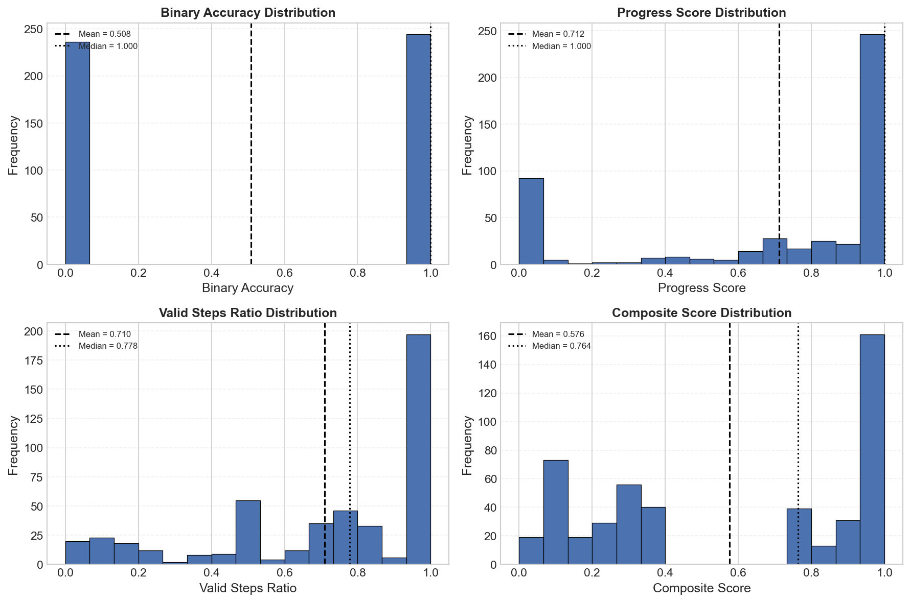
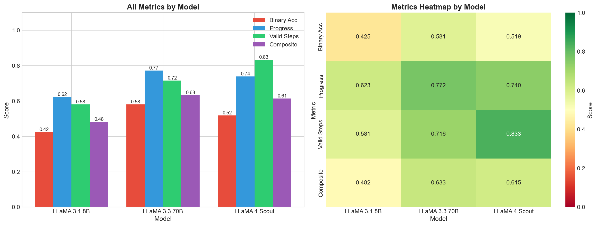
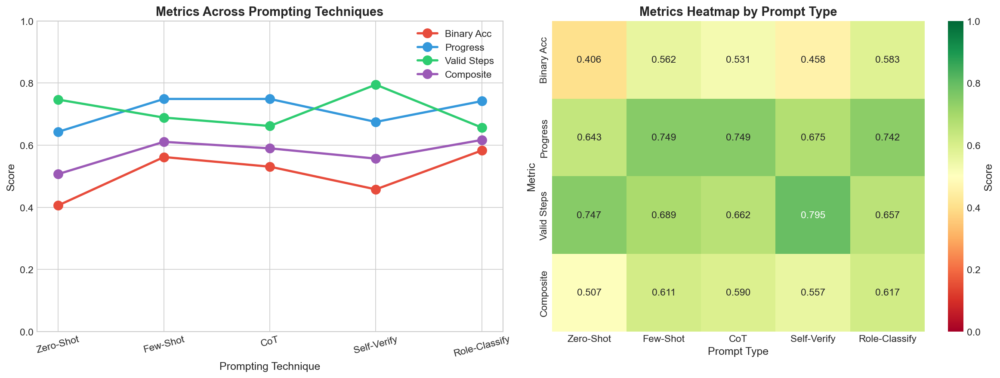
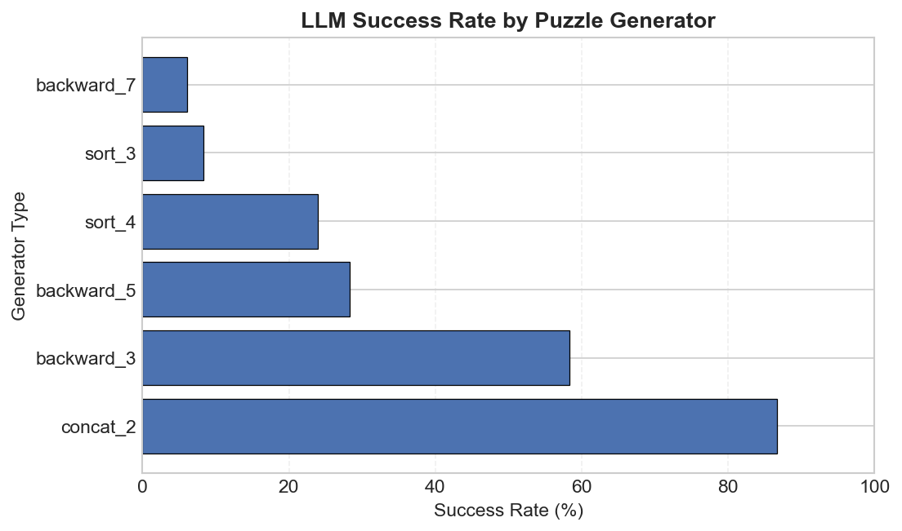
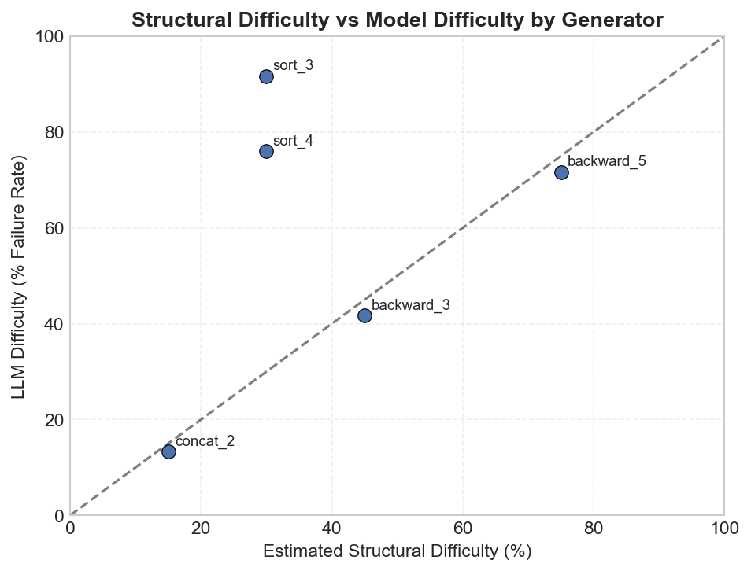

# Metrics & Human vs Machine

### Metrics Implemented

| Metric                      | Description                                                      | Range  |
| --------------------------- | ---------------------------------------------------------------- | ------ |
| **Binary Accuracy**   | 1 if solution is correct, 0 otherwise                            | [0, 1] |
| **Progress Score**    | Fraction of string reduced:$(|s_0| - |s_f|) / |s_0         | $ | [0, 1] |
| **Valid Steps Ratio** | Fraction of attempted steps that were syntactically valid        | [0, 1] |
| **Composite Score**   | Weighted combination of correctness, progress, and validity      | [0, 1] |

### Summary Statistics

**Total Evaluations: 480** (3 models × 5 prompts × 32 puzzles)

| Metric                      | Mean  | Std   | Median | Min | Max |
| --------------------------- | ----- | ----- | ------ | --- | --- |
| **Binary Accuracy**   | 0.508 | 0.500 | 1.000  | 0   | 1   |
| **Progress Score**    | 0.712 | 0.390 | 1.000  | 0   | 1   |
| **Valid Steps Ratio** | 0.710 | 0.320 | 0.778  | 0   | 1   |
| **Composite Score**   | 0.576 | 0.380 | 0.764  | 0   | 1   |

**Key Observation:** While only 50.8% of attempts are strictly correct, the average progress score (0.712) indicates many failures are near-complete solutions.

### Metric Correlations

```

                   Binary Acc  Progress  Valid Steps  Composite

Binary Accuracy       1.000     0.753       0.111       0.963

Progress Score        0.753     1.000       0.286       0.861

Valid Steps Ratio     0.111     0.286       1.000       0.330

Composite Score       0.963     0.861       0.330       1.000

```

**Critical Insight:**

> **Valid Steps Ratio has near-zero correlation with Binary Accuracy (r = 0.111)**, indicating that syntactic validity does not predict task success. High validity with low correctness = rule compliance without goal-directed reasoning.



### Metrics by Model



- LLaMA 3.3 70B has highest binary accuracy (0.581)
- LLaMA 4 Scout has highest valid steps ratio (0.833) but lower accuracy
- Larger models show better progress scores

### Metrics by Prompting Technique

| Prompt Type             | Binary Accuracy | Progress | Valid Steps | Composite |
| ----------------------- | --------------- | -------- | ----------- | --------- |
| **Zero-Shot**     | 0.406           | 0.643    | 0.747       | 0.507     |
| **Few-Shot**      | 0.562           | 0.749    | 0.689       | 0.611     |
| **CoT**           | 0.531           | 0.749    | 0.662       | 0.590     |
| **Self-Verify**   | 0.458           | 0.675    | 0.795       | 0.557     |
| **Role-Classify** | 0.583           | 0.742    | 0.657       | 0.617     |

- Role-Classify achieves highest binary accuracy (0.583)
- Self-Verify has highest valid steps ratio (0.795) but lower accuracy
- Few-Shot and CoT show similar progress scores (0.749)



### Edge Case Categories

| Category                   | Description                    | Binary Acc | Progress | Valid Steps | Composite |
| -------------------------- | ------------------------------ | ---------- | -------- | ----------- | --------- |
| **Correct Optimal**  | Exact correct solution         | ✓         | High     | High        | High      |
| **Correct Longer**   | Correct but redundant steps    | ✓         | High     | Low         | Medium    |
| **Almost There**     | ~94% progress, wrong final     | ✗         | High     | Low         | Medium    |
| **All Valid Wrong**  | All steps valid, wrong outcome | ✗         | Medium   | High        | Low       |
| **Minimal Progress** | Little progress, some valid    | ✗         | Low      | Medium      | Low       |
| **Zero Steps**       | No output or unparseable       | ✗         | Low      | Low         | Low       |

> Binary accuracy cannot distinguish near-miss reasoning from total failure. The "Almost There" category (94% progress) receives the same score as "Zero Steps" (0% progress).

### Key Findings

#### Finding 1: Binary Accuracy Is Overly Coarse

- Only 50.8% correct, but average progress is 71.2%
- Many failures are near-complete solutions
- Binary metric systematically underrepresents partial reasoning success

#### Finding 2: Valid Steps Ratio Can Be Misleading

- High validity (71.0%) does not guarantee semantic progress
- Common failure: high validity + low progress = rule compliance without reasoning
- Should not be used as standalone metric

#### Finding 3: Composite Score Provides Balanced Signal

- Integrates correctness, progress, and validity
- Rewards partial success, penalizes unproductive valid behavior
- Better discriminates between failure modes

---

## 2. Human vs Machine Analysis

### 2.1 Research Question

> Can we find examples that are:

> 1.**Easy for humans, hard for LLMs?**

> 2.**Hard for humans, easy for LLMs?**

### 2.2 LLM Success by Puzzle Type

| Generator            | Success Rate    | Total Evaluations | Unique Puzzles |
| -------------------- | --------------- | ----------------- | -------------- |
| **concat_2**   | **86.7%** | 45                | 3              |
| backward_3           | 58.3%           | 60                | 4              |
| backward_5           | 28.3%           | 60                | 4              |
| sort_4               | 24.0%           | 75                | 5              |
| **sort_3**     | **8.3%**  | 60                | 4              |
| **backward_7** | **6.1%**  | 180               | 12             |



### 2.3 Case Studies

#### Case 1: Sorting Puzzles (Easy Human, Hard LLM)

**Problem 059** — 0% LLM Success, ~100% Human Success

```

Initial: "#.##.#.."

Rules:   

  0: ".#" → "#."  (swap)

  1: "####...." → ""  (delete sorted)

Solution: [0, 0, 0, 0, 1]

```

**Human Solution (5 seconds):**

```

"#.##.#.." → "##.#.#.." → "###..#.." → "###.#..." → "####...." → ""

Human sees: "It's bubble sort! Move all # left, then delete."

```

**Why LLMs Fail:**

1. Don't recognize "bubble sort" pattern
2. Don't understand REPEATED application of same rule
3. Cannot simulate multiple steps ahead

#### Case 2: Long-Chain Puzzles (Hard for Both)

**Problem 022** — 0% LLM Success

```

Initial: "BDCAECAABEABCEBADBCAD"

Rules: 9 rules (7 useful, 2 distractors)

Solution: [0, 8, 1, 5, 4, 3, 2] (7 steps)

```

**Why Both Struggle:**

- 7+ steps with distractors
- Humans need trial-and-error, backtracking
- LLMs have no search capability

**Key Difference:** Humans CAN solve with patience (5+ minutes). LLMs have ONE shot.

#### Case 3: Concatenation Puzzles (Easy for Both)

**Problem 074** — 87% LLM Success

```

Initial: "EEZCHDRY"

Rules:   

  0: "EEZ" → ""

  1: "CHDRY" → ""

Solution: [0, 1]

```

**Why Both Succeed:**

- Direct substring matching
- Solution is "visible" in input
- 2-step solutions fit in "working memory"

### The Difficulty Matrix



> **Core Insight:** Humans excel at recognizing ALGORITHMS as patterns. LLMs see each puzzle as a fresh problem, missing the meta-structure.

---

## Conclusions

### Metrics Analysis Conclusions

1.**No single metric captures all aspects of reasoning quality**

2.**Valid steps ratio alone is insufficient** — high validity can mask semantic failure

3.**Composite score provides the best balance** for ranking and comparison

4.**Binary accuracy is necessary but not sufficient** — use with other metrics

### Human vs Machine Conclusions

1.**Sorting puzzles expose LLM weaknesses** — humans recognize algorithms, LLMs don't

2.**Concatenation puzzles are universally easy** — direct pattern matching works

3.**Long-chain reasoning challenges both** — but humans can use patience and backtracking

4.**The gap is in meta-cognition** — recognizing patterns of patterns

### Overall Takeaway

> **LLMs are not failing the benchmark; the benchmark is revealing where reasoning is not identifiable from surface behavior.**

Sorting puzzles are the clearest example: trivially easy for humans (who recognize bubble sort), catastrophically hard for LLMs (who cannot recognize iterative algorithms).

---

## References

- Notebooks: `metrics_analysis.ipynb`, `human_vs_machine.ipynb`
- Results: `../results/` directory
- Data: `../data/puzzles/`, `../data/solutions/`, `../data/metadata.json`
