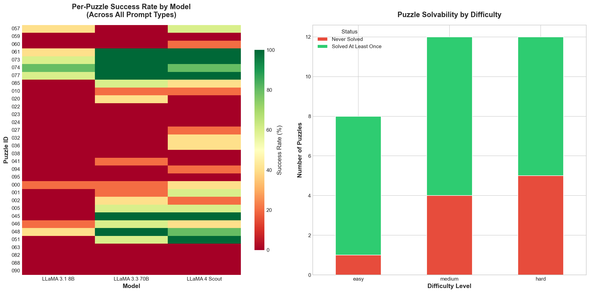
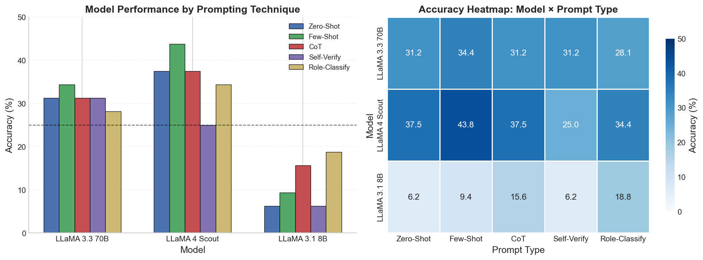

# SED Puzzle Dataset: Generation & Analysis

## Abstract

This document describes the generation methodology and statistical properties of a controlled benchmark dataset for evaluating reasoning in Large Language Models. The dataset comprises **100 String Edit Distance (SED) puzzles** spanning 8 generator types and 3 difficulty levels, designed to systematically probe sequential, algorithmic, and multi-phase reasoning capabilities.

---

## 1. Problem Formalization

An SED puzzle is defined as a 3-tuple $\mathcal{P} = (s_0, \mathcal{T}, \varepsilon)$ where:

- $s_0 \in \Sigma^*$ is the initial string
- $\mathcal{T} = \{t_1, ..., t_n\}$ is a set of rewrite rules $\alpha_i \to \beta_i$
- $\varepsilon$ is the goal state (empty string)

A **solution** is a sequence of rule indices $\sigma = [i_1, ..., i_k]$ such that:

$$
s_0 \xrightarrow{t_{i_1}} s_1 \xrightarrow{t_{i_2}} \cdots \xrightarrow{t_{i_k}} \varepsilon
$$

---

## 2. Generation Methodology

### 2.1 Core Principle: Backward Construction

> **Key Insight**: Generate puzzles from solutions, not solutions from puzzles.

By constructing strings iteratively from $\varepsilon$ (adding segments), the reverse sequence is guaranteed to be a valid solution. This eliminates expensive search during generation while ensuring solvability.

**Theorem**: If $s$ is constructed by prepending/appending segments $\{\alpha_1, ..., \alpha_k\}$ to $\varepsilon$, then applying $\{(\alpha_i, \varepsilon)\}$ in reverse order yields $\varepsilon$.

### 2.2 Two-Phase Pipeline

```
Phase 1: Pool Generation (250+ candidates)
    → Generator selection (weighted by difficulty)
    → BFS solving (for non-constructive generators)
    → Validation & duplicate detection
    → Difficulty analysis

Phase 2: Representative Selection (100 final)
    → Stratified sampling by difficulty
    → Generator diversity balancing
    → Quality-based ranking
```

### 2.3 Generator Types

| Generator          | Reasoning Type       | Approach     | Success Rate |
| ------------------ | -------------------- | ------------ | ------------ |
| `backward_3/5/7` | Sequential           | Constructive | 74–97%      |
| `concat_2`       | Pattern matching     | Constructive | 100%         |
| `sort_3/4`       | Algorithmic          | BFS-solved   | 12–27%      |
| `palin_3`        | Symmetry recognition | Constructive | 3–6%        |
| `multiphase`     | Multi-phase planning | BFS-solved   | 2.5%         |

---

## 3. Difficulty Quantification

### 3.1 Composite Difficulty Score

$$
D = \underbrace{\min(30, |\sigma| \cdot 3)}_{\text{solution length}} + \underbrace{\min(25, \bar{b} \cdot 5)}_{\text{branching}} + \underbrace{\min(20, |s_0| \cdot 0.5)}_{\text{string length}} + \underbrace{\min(15, d \cdot 3)}_{\text{distractors}} + \underbrace{10 \cdot \mathbb{1}[\text{exp}]}_{\text{expansion}}
$$

### 3.2 Difficulty Thresholds

| Level  | Score Range        | Interpretation                   |
| ------ | ------------------ | -------------------------------- |
| Easy   | $D < 25$         | Short solutions, low branching   |
| Medium | $25 \leq D < 50$ | Moderate planning required       |
| Hard   | $50 \leq D < 75$ | Long chains, distractors present |

---

## 4. Dataset Statistics

### 4.1 Overview

| Property            | Value                   |
| ------------------- | ----------------------- |
| Total problems      | 100                     |
| Generator types     | 8                       |
| Difficulty levels   | 3 (Easy, Medium, Hard)  |
| Solution length     | 1–10 steps (μ = 5.3)  |
| String length       | 5–25 chars (μ = 13.7) |
| Branching factor    | 1.0–5.3 (μ = 2.73)    |
| Distractors present | 69% of problems         |

### 4.2 Difficulty Distribution

| Level  | Count | Avg. Score | Interpretation        |
| ------ | ----- | ---------- | --------------------- |
| Easy   | 20    | 19.3       | Baseline calibration  |
| Medium | 40    | 32.6       | Core evaluation       |
| Hard   | 40    | 58.4       | Challenging reasoning |


*Figure 1: *Accuracy by Difficulty Level (Left) and Prompt Type(Left).**

### 4.3 Generator Distribution

| Generator      | Count | Difficulty Range | Primary Reasoning         |
| -------------- | ----- | ---------------- | ------------------------- |
| `backward_7` | 42    | Hard             | Long sequential chains    |
| `backward_3` | 15    | Medium           | Short sequential          |
| `backward_5` | 10    | Medium-Hard      | Medium sequential         |
| `concat_2`   | 10    | Easy             | Direct pattern match      |
| `sort_4`     | 10    | Hard             | Algorithmic (bubble sort) |
| `sort_3`     | 10    | Medium           | Algorithmic               |
| `palin_3`    | 4     | Hard             | Symmetry detection        |
| `multiphase` | 2     | Hard             | Phase planning            |


*Figure 2: Per-Puzzle Success Rate by Model and Puzzle Solvability by Difficulty*


*Figure 3: Model Performance by Prompting Technique and Accuracy Heatmap (Model × Prompt Type)*

**Key Correlations**:

| Relationship                        | Correlation (r) | Interpretation                          |
| ----------------------------------- | --------------- | --------------------------------------- |
| String Length ↔ Solution Length    | 0.62            | Longer strings require more steps       |
| Branching Factor ↔ Solution Length | 0.63            | More steps create more decision points  |
| String Length ↔ Branching Factor   | **0.92**  | Strongly coupled (potential redundancy) |

> **Note**: The high correlation between string length and branching factor (r = 0.92) suggests these features capture overlapping information. Future iterations may consider removing one from the difficulty formula.

---

## 5. Data Schema

### 5.1 Puzzle Format

```json
{
  "problem_id": "042",
  "initial_string": "BDCAECAABEABCEBADBCAD",
  "transitions": [
    {"src": "BCAD", "tgt": ""},
    {"src": "CE", "tgt": ""},
    ...
  ]
}
```

### 5.2 Solution Format

```json
{
  "problem_id": "042",
  "solution": [0, 8, 1, 5, 4, 3, 2]
}
```

### 5.3 Metadata Fields

| Field                | Type   | Description                    |
| -------------------- | ------ | ------------------------------ |
| `problem_id`       | string | 3-digit identifier             |
| `generator`        | string | Generation strategy            |
| `difficulty_score` | float  | Composite score [0–100]       |
| `difficulty_level` | string | easy / medium / hard           |
| `solution_length`  | int    | Number of steps                |
| `branching_factor` | float  | Avg. applicable rules per step |
| `num_distractors`  | int    | Unused rules in solution       |

---

## 6. Quality Assurance

### 6.1 Validation Pipeline

1. **Solvability**: BFS solver verifies all puzzles reach $\varepsilon$
2. **Optimality**: Solutions are shortest paths (BFS guarantee)
3. **Uniqueness**: Duplicate detection by initial string
4. **Verification**: Step-by-step execution confirms solution validity

### 6.2 Selection Criteria

- Stratified sampling ensures difficulty coverage
- Generator balancing prevents single-type dominance
- Quality scoring penalizes trivial puzzles (1-step solutions)
- Distractor presence required for majority of puzzles

---

## 7. Implications for LLM Evaluation

### 7.1 Reasoning Modes Tested

| Reasoning Type        | Generators    | LLM Challenge                      |
| --------------------- | ------------- | ---------------------------------- |
| **Sequential**  | backward_*    | Order-dependent rule application   |
| **Algorithmic** | sort_*        | Iterative refinement (bubble sort) |
| **Multi-phase** | multiphase    | Phase transitions, trap avoidance  |
| **Pattern**     | concat, palin | Direct substring matching          |

### 7.2 Evaluation Suitability

- **Controlled difficulty**: Enables performance stratification
- **Verifiable ground truth**: Binary correctness is unambiguous
- **Diverse reasoning**: Multiple cognitive demands in single benchmark
- **Distractor prevalence**: Tests robustness to misleading options

### 7.3 Hypothesized Difficulty for LLMs

| Easy for LLMs               | Hard for LLMs                               |
| --------------------------- | ------------------------------------------- |
| `concat_2` (direct match) | `sort_*` (requires iteration recognition) |
| Short `backward_3`        | Long `backward_7` (7+ step planning)      |
| —                          | `multiphase` (phase awareness)            |

---

## 8. Limitations & Future Work

### 8.1 Current Limitations

- No expert-level puzzles (score ≥ 75) in final dataset
- `expansion` generator broken (0% success rate)
- High correlation between string length and branching factor

### 8.2 Future Directions

- Calibrate difficulty against human performance
- Add non-monotonic reasoning puzzles (expansion)
- Reduce feature redundancy in difficulty formula
- Expand to 200+ puzzles for statistical power

---

## References

**Code**: `sed-reasoning/dataset_generation/`
**Data**: `sed-reasoning/data/`
**Analysis**: `sed-reasoning/notebooks/data_analysis.ipynb`

---

*Technical documentation for the SED-Reasoning benchmark project.*
